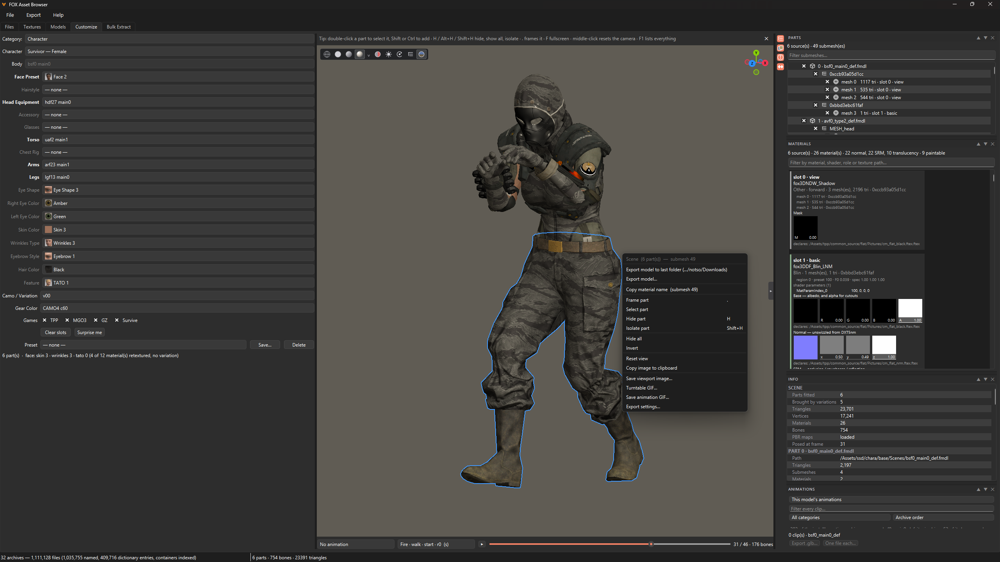
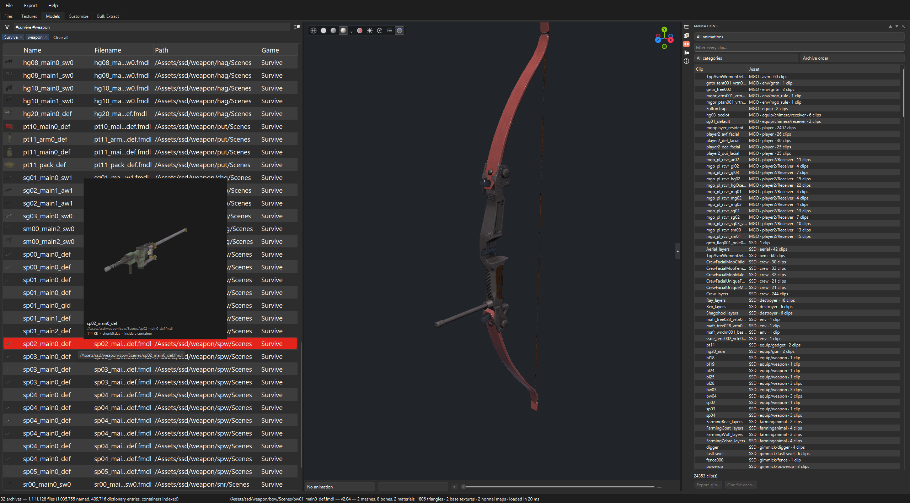
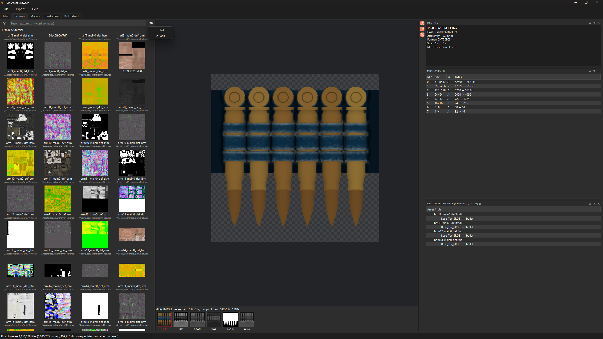
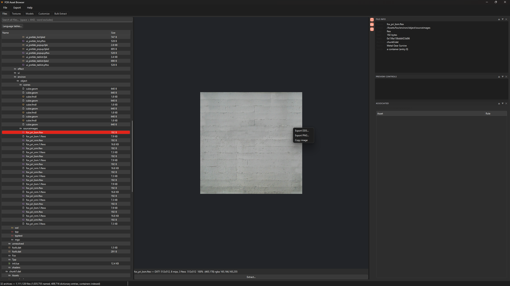
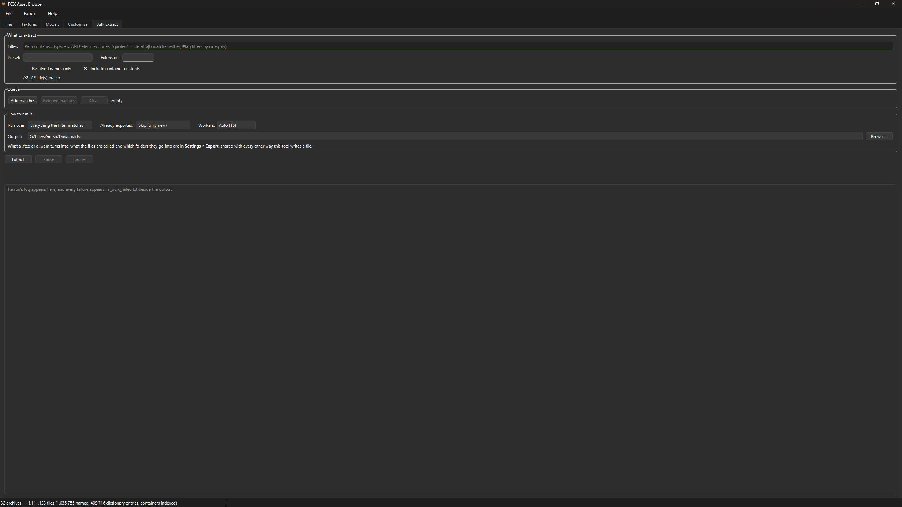

# FOX Asset Browser

**A native browser, viewer, character builder and extractor for Fox Engine
games — and, as of 1.0, a modding tool that can put files back.**

Point it at a **Metal Gear Solid V: The Phantom Pain**, **Ground Zeroes**,
**Metal Gear Online 3** or **Metal Gear Survive** install. It reads the QAR
(`.dat` / `.g0s`) archives directly, resolves hashed names through the
community dictionaries, looks *inside* the FPK/FPKD/PFTXS containers where the
interesting files actually live, and shows you what is there — models posed on
real animation, textures decoded, materials and shader parameters, the
customisation tables that decide what a character can wear.

Then it exports: one file, one slot, one variation, or everything matching a
filter — with real names and the original folder structure.

[foxanimrip](https://github.com/trappuss/FOXanimrip) is this project's
predecessor: a headless bulk ripper driving FoxBrowser's decoders. **FOX Asset
Browser replaces it and shares no code with it.** Every format reader here is a
native C++ port, so it needs nothing installed but the game.



*The Customize tab on a full install. A Survive player assembled from six
parts — **five of them brought in by the variation tables** — with the face,
eyes, skin, wrinkles, eyebrows, hair colour and tattoo the game's own catalogue
offers, a camouflage variation and a two-channel gear colour, posed at frame 31
of a clip out of the archives. 754 bones, 23,701 triangles, 26 materials, and
every one of them inspectable on the right.*

---

## Preview

| | |
|---|---|
| **Models** — filter by tag (`#survive #weapon`), hover any row for a preview that says where the file lives, and open the animation panel: **24,353 clips** across every archive, grouped by the asset they belong to. | **Textures** — 196,836 of them, as a grid or a list. Alpha is shown against a checkerboard, each channel is one click away, and the mip table says which levels are present and which stream in from where. |
|  |  |
| **Files** — the whole index as a tree, with a preview and a pixel readout for anything that decodes, and the export set on every row. The panel names the archive a file came out of and whether it was found inside a container. | **Bulk Extract** — filter by path, extension, tag or resolved-only; **739,619 files** match here with container contents included. Fifteen workers, and an FPK is opened once for all of its matches. |
|  |  |

<sub>Real screenshots, on a real install: 32 archives, 1,111,128 files,
1,035,755 of them resolved to names through the community dictionaries. The
texture selected in the Textures shot is one of the ones that is **not** — a
bare hash — and the tool still knows the four models that bind it, and the slot
each binds it to.</sub>

---

## 📖 The Fox Engine Asset Handbook

Fox Engine is finished; no further games will be built on it. What is in these
files is all there will ever be.

**[→ Read the handbook in the wiki](../../wiki)** — the archives, the models,
the textures, the rig, and the MGO 3 avatar system in unusual depth, written so
the next person to open these files does not have to rediscover it:

| Page | Covers |
|------|--------|
| [Archives and Hashing](../../wiki/Archives-and-Hashing) | SQAR, the 64-bit path hash and its verification, extension codes, containers, dictionaries |
| [Models and Skeletons](../../wiki/Models-and-Skeletons) | FMDL, bone naming, the shared rig, FRIG/FRDV, the translation-only bind pose |
| [Textures and Materials](../../wiki/Textures-and-Materials) | FTEX streamed mips, the map-suffix vocabulary, DXT5nm, SRM, and why there is no metalness map |
| [Animation and Rigging](../../wiki/Animation-and-Rigging) | MTAR, GANI, 59.94 fps, rig binding and the measured threshold |
| **[MGO Avatar and Gear](../../wiki/MGO-Avatar-and-Gear)** | **The centrepiece: how MGO 3 builds a player, the id→model join read out of the game's own tables, and the traps** |
| [Characters and Customization](../../wiki/Characters-and-Customization) | Asset layout, naming, FOVA variation, Survive's differences |
| [Modding and Packaging](../../wiki/Modding-and-Packaging) | The mount-don't-edit design, the FTEX writer, and the `.mgsv` format written out in full |
| [Toolchain and Verification](../../wiki/Toolchain-and-Verification) | The harness, the invariants, and how to check any claim here |
| [Open Questions](../../wiki/Open-Questions) | What is still unknown, and the next experiment for each |
| [Prior Art and Tools](../../wiki/Prior-Art-and-Tools) | The other projects that have opened these files, and which to reach for |

Every claim in the handbook is measured from shipped files and says how it was
established. Where something is inferred it is marked **[inferred]**; where it
is unresolved, **[open]**.

One result worth putting on the front page — the 64-bit `PathFileNameCode` is
not taken on trust here. A PFTXS pack stores the full hash of every texture it
holds, written by Konami, so the hash can be checked against shipped bytes
rather than against our own reader:

```
4 packs: 17 group hashes, 34 sub-entry hashes
group hashes whose top 13 bits are our 'ftex' extension code   17 of 17
sub-entry extension codes    0x2ad x17 -> ftex   0x1658 x17 -> 1.ftexs
names from the dictionaries that reproduce a shipped pack hash  3 exact
```

---

## What you need

* **Windows 10/11 64-bit.** No runtime to install — the release is a portable
  folder, and settings, caches and logs live in `data\` beside the exe. No
  registry, no `%AppData%`, no installer.
* **A Fox Engine game installed.** TPP, Ground Zeroes, MGO 3 (through the TPP
  install) or Metal Gear Survive.
* **Nothing else.** The hash dictionaries — 31 MB of community tables that turn
  hashes back into names — are inside the release zip in `dict\`. Without them
  the tool still runs; files just appear as `unresolved/<hex>`.

## Quick start

1. Download `FOXAssetBrowser_portable.zip` from the release and unzip it
   anywhere.
2. Run **`FOXAssetBrowser.exe`**.
3. **File ▸ Set game folder…** and point it at your install.
4. Wait out the first index. The deep scan opens every container once and
   caches the listing, so the second launch is instant.

Then: **Files** to browse and extract, **Textures** to preview and export DDS
or PNG, **Models** to view and export `.glb`, **Customize** to build a
character or a weapon, **Bulk Extract** to pull everything matching a filter.

### The ready-made scripts

Every measurement this project makes is a double-click. Each script finds the
build itself, writes into `_deliveries\`, and copies the log beside its output:

| script | what it settles |
|--------|-----------------|
| `Diagnose - Accessory Positions.bat` | every item of every slot, on both genders, with a residual |
| `Diagnose - One Item.bat` | the full per-part table for one item |
| `Package - Mod Folder.bat` | packages your mod folder both ways, then checks Windows can read it back |
| `Audit - Asset Health.bat` | what resolves, what does not, and what is missing |
| `Cache - Rebuild Index.bat` | drop the caches and rebuild from the archives |
| `Measure - Weapon Camo Census.bat` | every camo/variation row the menus would build |
| `Measure - Animation Binding.bat` | which animation sets fit which skeleton |
| `Measure - Startup Timings.bat` | cold and warm launch, phase by phase |
| `Measure - Deep Scan Acceptance.bat` | one worker vs eight — the hashes must match |
| `Measure - Texture Users.bat` | the texture→model map, timed |
| `Measure - Lighting Rigs.bat` | the four per-game lighting rigs |

`READ ME - what these do.txt` explains each one in plain language.

---

## What it does

**Archive reading, natively.** SQAR containers — both the MGSV format and
Survive's version-2 variant — including header and section-table decryption and
both per-entry payload ciphers, ported byte-for-byte from GzsTool. `.g0s` for
Ground Zeroes, with its own legacy hash scheme.

**The container trap, solved.** Most interesting files (`.fmdl`, `.lua`,
`.mtar`, `.ftex`) hide inside `.fpk`/`.fpkd`/`.pftxs` packages that a plain
archive walk never sees — 1.1 million of them on a full TPP install. The deep
scan decompresses each container once, records its child listing with the real
stored paths, and caches the result keyed on every archive's size and mtime.

**Textures end to end.** `.ftex` headers plus their streamed `.N.ftexs` mips —
found by hash across the separate texture archives, or inside PFTXS packs —
reassembled into standard `.dds`, decoded on the CPU for preview, exported as
DDS or PNG. And now written back: a DDS re-encodes into the original's exact
layout (see below).

**Models, posed.** FMDL with the full material table, FRIG rig units, FRDV help
bones, and MTAR/GANI animation. Export to `.glb` — the scene, one part, one
slot, one variation, or rigged with one glTF animation per clip.

**Customize.** Build a character, a weapon, a vehicle, or compose free-form
parts. Fixed slots driven by the game's own catalogues, FOVA form variation,
MGO 3's per-item two-channel gear colour, saved presets, undo/redo.

**Modding — a mount, not an edit.** A mod folder of replacement assets is
mounted *over* the archives at a higher priority, exactly the way the index
already modelled a mod install. Nothing is ever written into a `.dat`, `.qar`
or `.fpk`, so a mistake costs you a wrong pixel and not a game that will not
boot. Deleting the folder is the uninstall.

**Packaging.** Export a mod folder as a plain ZIP with a manifest, or as a real
SnakeBite `.mgsv` — the metadata written to match what SnakeBite's own
serialiser produces, byte for byte, verified by compiling its classes and
running them against the file.

---

## Building from source

Prereqs: **Visual Studio 2022** with the *Desktop development with C++*
workload, and **git**.

```bat
setup.bat          :: first time - bootstraps vcpkg, restores Qt6, builds
rebuild.bat        :: day to day  - incremental build + launch
clean-rebuild.bat  :: from scratch
verify-src.py      :: the source checker every change must pass
"Release - Make Portable.bat"   :: the zip-and-send folder
```

C++17, Qt6, OpenGL, CMake + vcpkg. The Qt6 dependencies restore from the vcpkg
binary cache in minutes if they have been built on the machine before.

`publish.bat` builds nothing — it puts the repository, the release and the wiki
on GitHub in one double-click.

---

## Game support

| Game | Status |
|------|--------|
| **MGSV: The Phantom Pain** | Verified end to end |
| **MGSV: Ground Zeroes** | Verified — `.g0s` archives and the legacy hash scheme |
| **Metal Gear Online 3** | Verified through the TPP install; the avatar and gear system is documented in depth |
| **Metal Gear Survive** | Verified — separate `/Assets/ssd/` root, shared formats |

Archive support: `.dat`, `.g0s`, `.qar`, with `.fpk` / `.fpkd` / `.pftxs`
nested inside.

## Project status

Browsing, previewing, composing and extracting are complete and in daily use.
The modding path — mount, replace, revert, re-encode a texture, package —
is complete and verified against this tool's own readers.

**Honestly stated, because it matters:**

- **No replaced asset has been loaded by the game yet.** The FTEX writer
  matches the shipped chunking on 2,233 of 2,233 mips and the `.mgsv` metadata
  round-trips through SnakeBite's own classes, but the engine and the mod
  manager are the only authorities and neither has been asked.
- **Accessory placement in the Customize composer is wrong for some items**,
  and the metric that reported it as correct was measuring the wrong thing —
  the part's root *bone*, not its geometry. It is the top of the list. See
  [Open Questions](../../wiki/Open-Questions).

## Licence and credits

MIT — see [LICENSE](LICENSE).

This tool's format readers are **direct C++ ports of other people's work**, and
the handbook says so at every point it matters:

- **GzsTool** (Atvaark) — QAR/FPK/PFTXS structure and ciphers.
- **FtexTool** (Atvaark) — FTEX/FTEXS layout and the DDS mapping; the writer
  here is the inverse of that reader.
- **mgsv-lookup-strings** (kapuragu) and the FoxBrowser dictionaries — the name
  databases that make hashes readable.
- **CityHash** (Google, MIT) — vendored verbatim, for bit-exact hashing.
- **SnakeBite** (topher-au and contributors) — the `.mgsv` package format.
- **FoxBrowser** — the viewer that showed what was possible. Nothing of it is
  bundled or required here, but if you find this useful, go and endorse
  [FoxBrowser on Nexus Mods](https://www.nexusmods.com/metalgearsolidvtpp/mods/2531).

Further projects are collected in
[Prior Art and Tools](../../wiki/Prior-Art-and-Tools).

Metal Gear Solid, Ground Zeroes, The Phantom Pain, Metal Gear Online, Metal
Gear Survive and Fox Engine are trademarks of Konami. This project is not
affiliated with Konami and ships no game assets.
